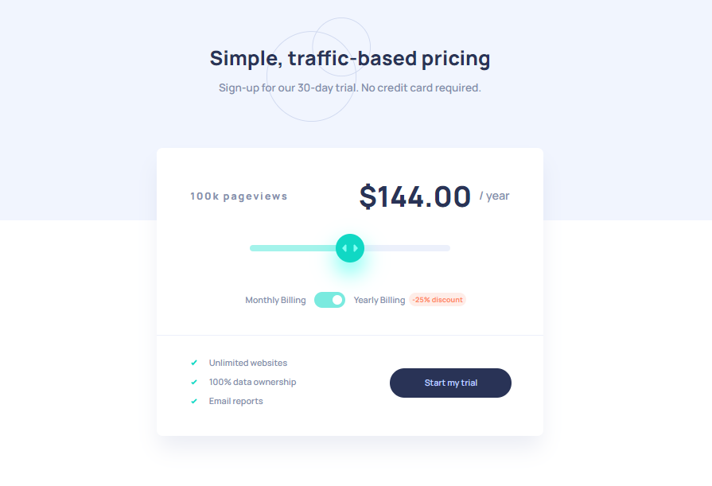

# Project - Interactive pricing component solution

### The challenge

Users should be able to:

- View the optimal layout for the app depending on their device's screen size
- See hover states for all interactive elements on the page
- Use the slider and toggle to see prices for different page view numbers

### Screenshot

### Links

- Solution URL: https://github.com/giorgisilagadze/interactive-pricing-component
- Live Site URL: https://interactive-pricing-component-lake-three.vercel.app

## My process

### Built with

- Semantic HTML5 markup
- CSS custom properties
- Flexbox
- Mobile-first workflow
- Javascript

### What I learned

By this project I've learned how to use DOM manipulations more deeply.